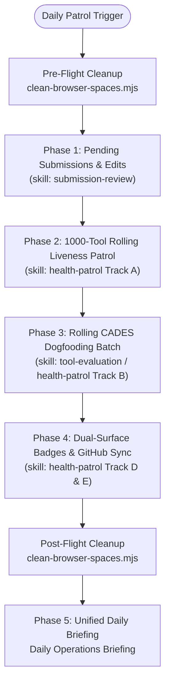

# Autonomous Daily Operations Patrol (`autonomous-patrol`)

This skill defines the **master daily operations orchestrator** for `nologin.tools`. It coordinates the specialized skills across the daily operational lifecycle:



---

## 1. Operating Principles & Safety Guardrails

1. **Zero Destructive Deletes**: Never execute `DELETE FROM tools`. Inactive, dead, or non-compliant tools are marked `status = 'unstable'` or `'rejected'`. All operations remain reversible.
2. **High-Confidence Autonomous Authority**: The Agent is authorized to query and update the remote Cloudflare D1 database (`nologin-tools-db`) using `npx wrangler d1 execute nologin-tools-db --remote`.
3. **Strict Concurrency Guardrail**: All browser operations (`ego-browser`, `inspect-tool-dogfood.mjs`, `dogfood-session.mjs`) **MUST run sequentially (`concurrency = 1`)**. Never run concurrent browser subagents.
4. **Mandatory TaskSpace Sweeps**: Run `node scripts/clean-browser-spaces.mjs` before and after daily operations to guarantee no dangling Chromium spaces remain in memory.

---

## 2. Daily Patrol Execution Workflow

### Step 0: Pre-Flight Cleanup
Before running any checks, ensure the browser environment is completely clean:
```bash
node scripts/clean-browser-spaces.mjs
```

---

### Phase 1: Clear Pending Queue (Submissions & Edit Suggestions)
> **Delegated Skill**: [`submission-review`](file:///Users/lin/hime/nologin.tools/.agents/skills/submission-review/SKILL.md)

1. Query pending submissions in D1:
   ```bash
   npx wrangler d1 execute nologin-tools-db --remote --json --command "SELECT id, name, url, description, core_task, submitter_email, repo_url FROM tools WHERE status = 'pending' ORDER BY id ASC;"
   ```
2. Apply **Immediate Hard Rejection Filters** (ephemeral tunnels, preview branches, direct repos, storefronts, spam bots).
3. Apply **Platform Subdomain Anti-Slicing Policy** (max 1 tool per root host on `*.vercel.app`, `*.pages.dev`, `*.netlify.app`).
4. Apply **Open-Source Green Channel** for verified `*.github.io` tools.
5. For ungated candidates, run **Empirical Evaluation Gatekeeper** via [`tool-evaluation`](file:///Users/lin/hime/nologin.tools/.agents/skills/tool-evaluation/SKILL.md) (requires Product Score $\ge 70$, zero bait-traps).
6. For approved tools:
   - Synthesize clean metadata and standard taxonomy tags.
   - Synchronize translations across all 7 non-English locales: `node scripts/sync-tool-translations.mjs --apply <payload.json>`.
   - Update remote D1 to `status = 'approved'`.
7. Audit pending edit suggestions in `edit_suggestions` table.

---

### Phase 2: Rolling Health & Dead-Link Patrol (1000 Tools)
> **Delegated Skill**: [`health-patrol`](file:///Users/lin/hime/nologin.tools/.agents/skills/health-patrol/SKILL.md) (Track A)

1. Select 1000 approved tools with dynamic risk priority (unstable tools first, then platform subdomains unchecked in 24h, then oldest checked).
2. Probe HTTP connectivity with `User-Agent: NoLoginTools-HealthChecker/1.0`.
3. Auto-heal 301 permanent redirects (update `url` and `slug`).
4. Remediate dead links (404, DNS error, parked) by marking `status = 'unstable'`.
5. Record results in `health_checks` table.

---

### Phase 3: Rolling CADES Dogfooding Batch (15–25 Tools/Day)
> **Delegated Skill**: [`tool-evaluation`](file:///Users/lin/hime/nologin.tools/.agents/skills/tool-evaluation/SKILL.md) / [`health-patrol`](file:///Users/lin/hime/nologin.tools/.agents/skills/health-patrol/SKILL.md) (Track B & C)

1. Run rolling CADES dogfooding on the 20 oldest-tested tools to prevent post-action paywalls or silent commercial watermarks:
   ```bash
   node scripts/inspect-tool-dogfood.mjs --rolling 20 --sync
   ```
2. If any tool shows regressions or post-action bait traps:
   - Escalate to single-tool inspection.
   - Demote to `status = 'unstable'`.
   - Clear `is_featured = 0`.

---

### Phase 4: Dual-Surface Badges & GitHub Sync
> **Delegated Skill**: [`health-patrol`](file:///Users/lin/hime/nologin.tools/.agents/skills/health-patrol/SKILL.md) (Track D & E)

1. **Badge Verification**:
   - Inspect homepage DOM for explicit/implicit NoLogin badges.
   - Inspect GitHub README for badge markdown.
   - Update `badge_displays` table.
2. **GitHub Sync**:
   - Query GitHub API for tools with `repo_url`.
   - Refresh stars, forks, license, language, and `github_updated_at`.

---

### Step 5: Post-Flight Cleanup
Clean up any browser spaces created during the patrol:
```bash
node scripts/clean-browser-spaces.mjs
```

---

### Phase 5: Generate Daily Operations Briefing

At the conclusion of the patrol run, format and output the unified briefing:

```markdown
### 🤖 Daily Operations Briefing (<YYYY-MM-DD>)

- **Pending Submissions**:
  - Approved: X (list names, categories & scores)
  - Rejected: Y
    - 🚫 Hard Login Wall: Y1
    - 🌐 Domain / Tunnel / Branch Preview: Y2
    - ✂️ Slicing / SEO Spam / Bot: Y3
    - 💀 Dead Link / DNS Failure: Y4
    - 📦 Desktop Client / Storefront: Y5
  - Pending Review: Z (ambiguous items)
- **Edit Suggestions**:
  - Approved: X | Rejected: Y
- **Rolling Patrol (1000 Tools)**:
  - Healthy (Online): A
  - Abnormal / Newly Unstable: B (list names & detected issues)
  - Recovered to Approved: C
  - Redirects Self-Healed: D (list old -> new URLs)
- **Rolling CADES Dogfooding (20 Tools)**:
  - Audited: 20
  - Regressions / Injected Traps: E
- **Badge Detections**:
  - Explicit badges: F
  - Implicit badges: G
- **GitHub Sync**:
  - Repositories refreshed: H
```
