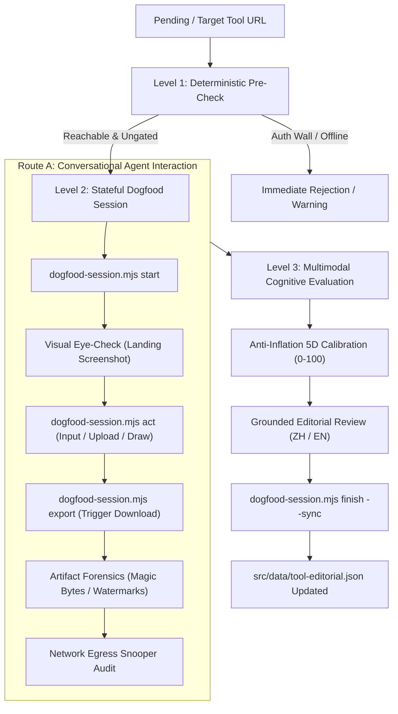

# CADES 2.0: Route A Specification
## Cognitive Agent Dogfooding & Empirical Vetting System

> **Document Version**: 2.0.0  
> **Status**: Production Standard  
> **Target Audience**: AI Agents (Antigravity/Ego-Browser), Human Reviewers, Site Maintainers  
> **Location**: `docs/CADES-2.0-ROUTE-A-SPEC.md`

---

## 1. Executive Summary & Philosophy

In NoLogin Tools (`nologin.tools`), the credibility of our directory rests upon **empirical truth**. Many directories rely on scraped metadata, marketing claims, or superficial script checks that merely verify HTTP 200 responses.

**Route A (Agent-Led Conversational Dogfooding)** establishes an authentic testing protocol where an AI Agent operates as an autonomous, discerning human tester:
1. **Real Interaction**: The Agent personally drives a live Chromium session (`ego-browser`), types into input fields, drags sliders, draws on canvases, and uploads realistic test fixtures (`scripts/lab/fixtures/`).
2. **Visual Eye-Check**: The Agent visually inspects high-resolution screenshots via multimodal capabilities (`view_file`), validating rendering quality, layout integrity, and absence of deceptive overlays.
3. **Artifact Forensic Inspection**: The Agent triggers real file downloads and subjects the resulting artifacts to binary forensic inspection (`output-inspector.mjs`) to detect fake downloads, login traps, watermarks, and corrupt headers.
4. **Data Sovereignty Audit**: The harness intercepts all background network requests during the session to objectively verify whether user data remains 100% local or leaks to remote servers.
5. **Anti-Inflation Editorial Review**: The Agent produces grounded, critical, human-like editorial reviews with balanced pros and cons, calibrated by an anti-inflation rating engine to prevent grade inflation.



---

## 2. System Architecture

Route A combines three tightly coordinated layers:

### 2.1 State-Preserving Browser Harness (`ego-browser` + `dogfood-session.mjs`)
- Uses isolated Chromium `taskSpace` instances managed through the native `ego-browser nodejs` interface.
- State is serialized in `/tmp/cades-session-<slug>.json`, allowing the Agent to execute multi-turn commands (`start` $\rightarrow$ `act` $\rightarrow$ `export` $\rightarrow$ `finish`) across separate CLI invocations without losing browser context.
- Automatic event handlers capture console errors, network requests, download streams, and navigation transitions.

### 2.2 Forensic Inspectors & Grounded Fixtures
- **Standard & Stress Fixtures** (`scripts/lab/fixtures/generate-fixtures.mjs`):
  - `sample.png`: Valid RGBA PNG image with geometry markers.
  - `sample.svg`: Valid scalable vector graphic with explicit paths.
  - `sample.json`: Valid nested JSON dataset for developer tools.
  - `sample.md`: Markdown document with headers, code fences, and tables.
  - `sample.wav`: PCM audio waveform fixture.
  - `sample.pdf`: Multi-element PDF fixture.
  - **Stress & Edge-Case Fixtures**:
    - `malformed-json`: Invalid JSON with syntax errors, trailing commas, and unclosed arrays to test UI error handling.
    - `corrupted-png`: Truncated PNG missing `IEND` and truncated scanlines to test image parse error resilience.
    - `heavy-svg`: Vector stress asset with 800+ nested geometric nodes to test rendering performance and canvas jank.
- **Output Inspector** (`scripts/lab/inspectors/output-inspector.mjs`):
  - **Magic Bytes Validation**: Verifies binary signatures (e.g. `89 50 4E 47` for PNG, `%PDF-` for PDF) to ensure downloads are not corrupted or fake.
  - **Anti-Bait-Trap Detection**: Detects decoy downloads where an application serves an HTML login or error page named `.png` or `.pdf` to deceive unauthenticated users.
  - **Watermark & Resolution Forensics**: Checks SVG/image files for commercial promotional watermarks (`"created with"`, `"free trial"`) and verifies non-empty canvas buffers.

### 2.3 UX Ergonomics Telemetry & Anti-Slacking Engine
- **In-Browser UX Telemetry (`PerformanceObserver`)**:
  - Automatically captures **Long Tasks** (tasks $>50\text{ms}$ locking the main UI thread).
  - Automatically measures **Cumulative Layout Shift (CLS)** during interaction.
  - Generates real-time ergonomics reports on every step (`act`, `export`, `start`).
- **Anti-Slacking Guardrail**:
  - Mandates at least 1 deliberate user interaction (`act` or `export`) before a session can be finalized.
  - Strictly prevents shallow `start` $\rightarrow$ `finish` shortcuts unless explicitly overridden with `--allow-shallow` for static read-only pages.
- **Forensic Flight Recorder (`/tmp/cades-flight-recorder-<slug>.json`)**:
  - Compiles the entire chronological flight log: turn-by-turn actions, screenshot paths, UX metrics, network egress payload logs, and artifact inspection results.

---

## 3. The 3-Level Testing Funnel

### Level 1: Deterministic Gate
Executed prior to launching deep interaction. Fast, automated, non-invasive:
- **Reachability**: HTTP status must be reachable without DNS failure or persistent timeouts.
- **Immediate Auth Wall**: No mandatory login modal blocking initial usage.
- **Target Category Match**: Confirms tool matches its claimed functional profile.

### Level 2: Stateful Multi-Turn Agent Dogfooding
The Agent drives the browser through realistic user workflows:
1. **Initialize Session**: Launches `dogfood-session.mjs start <url>`, capturing the initial viewport and interactive DOM map.
2. **Execute Core Workflow**: Uses `dogfood-session.mjs act <slug>` to input data or upload fixtures relevant to the tool's category (e.g. SVG to a code optimizer, text to a markdown previewer).
3. **Trigger Output**: Invokes `dogfood-session.mjs export <slug> --trigger <selector>` to test export capabilities.
4. **Network Leak Check**: Inspects zero-egress telemetry to confirm if payloads were transmitted off-device.

### Level 3: Multimodal Cognitive Evaluation
The Agent reviews the session evidence:
1. Calls `view_file` on screenshots to verify layout, rendering clarity, and lack of visual spam.
2. Computes 5D dimension scores aligned with empirical findings.
3. Formulates an honest, critical editorial review with tangible strengths and limitations.
4. Finalizes the session with `dogfood-session.mjs finish <slug> --eval <payload.json> --sync`.

---

## 4. CLI Command Reference

All operations run via `node scripts/lab/dogfood-session.mjs <subcommand>`.

### 4.1 `start <url> [--slug <slug>]`
Initializes a new persistent `taskSpace`, injects network monitoring, navigates to the URL, and captures the landing screenshot.

```bash
node scripts/lab/dogfood-session.mjs start https://excalidraw.com --slug excalidraw-com
```

**Output**:
- Session state saved to `/tmp/cades-session-<slug>.json`.
- Screenshot saved to `/tmp/cades-session-<slug>/01-landing.png`.
- Summary of primary inputs, buttons, and DOM candidate targets.

### 4.2 `act <slug> [actions...]`
Applies one or more actions to the active page and takes a refreshed screenshot.

```bash
# Example 1: Fill an input and click a button
node scripts/lab/dogfood-session.mjs act excalidraw-com \
  --fill "textarea, [contenteditable='true']" "Hello NoLogin Architecture" \
  --click "button[title='Export']"

# Example 2: Upload a standard fixture
node scripts/lab/dogfood-session.mjs act svgomg \
  --upload svg

# Example 3: Execute custom script evaluation
node scripts/lab/dogfood-session.mjs act my-tool \
  --eval-js "document.querySelector('canvas') !== null"
```

**Supported Options**:
- `--click <selector>`: Clicks matching DOM selector or text query.
- `--fill <selector> <text>`: Types text into input, textarea, or contenteditable.
- `--upload <fixtureKey>`: Injects test fixture (`png`, `svg`, `json`, `md`, `wav`, `pdf`) into file inputs.
- `--press <key>`: Simulates keyboard key presses (e.g. `Enter`, `Escape`, `Tab`).
- `--eval-js <code>`: Evaluates JavaScript expression in browser context.

### 4.3 `export <slug> [--trigger <selector>]`
Waits for and captures file downloads, then runs `output-inspector.mjs`.

```bash
node scripts/lab/dogfood-session.mjs export excalidraw-com --trigger "button:has-text('Save to disk')"
```

**Output**:
- Downloaded file stored in `/tmp/cades-session-<slug>/downloads/`.
- Forensic report: magic bytes, MIME detection, size, watermark check, anti-trap verification.

### 4.4 `status <slug>`
Inspects the current state of an active session without modifying DOM.

```bash
node scripts/lab/dogfood-session.mjs status excalidraw-com
```

### 4.5 `finish <slug> [--eval <json-file>] [--sync] [--allow-shallow]`
Terminates the browser `taskSpace`, enforces Anti-Slacking Guardrails, calculates network egress statistics, generates the Forensic Flight Recorder (`cades-flight-recorder-<slug>.json`), validates cognitive payload, and optionally merges results into `src/data/tool-editorial.json`.

```bash
node scripts/lab/dogfood-session.mjs finish excalidraw-com --eval /tmp/eval-excalidraw.json --sync
```

> [!NOTE]
> **Anti-Slacking Guardrail**: Sessions with 0 interactive user actions (`act` or `export`) will be rejected unless explicitly passed `--allow-shallow` (reserved for purely static landing pages).

### 4.6 `abort <slug>`
Emergency cleanup: forcefully destroys the `taskSpace` and cleans up temporary session files.

```bash
node scripts/lab/dogfood-session.mjs abort excalidraw-com
```

---

## 5. Anti-Inflation 5D Scoring Rubric

To prevent score clustering at 90+ and ensure high differentiation across the catalog, scores are calibrated across five discrete dimensions (0-100 total):

| Dimension | Max Points | Core Criteria | Calibrated Ceiling Rules |
| :--- | :---: | :--- | :--- |
| **Frictionless UX** | **20** | Immediate access, zero gating, clean responsive layout, no deceptive ad modals. | - If any auth wall appears: **0**<br>- If cookie banner/popups block viewport: max **14**<br>- Pure zero-click immediate utility: **18-20** |
| **Functional Depth & Fidelity** | **25** | Depth of core capabilities, support for complex workflows, precision handling of edge cases. | - Simple single-purpose tools (e.g. single-click text reverser, basic uuid gen): **12-16**<br>- Full-featured workstation (e.g. Excalidraw, Photopea): **22-25** |
| **Export Freedom** | **20** | Standard uncorrupted formats, multiple export targets, copy-to-clipboard, zero watermarks. | - Watermark detected: **0-8**<br>- Bait trap / fake HTML download: **0**<br>- Multiple lossless formats (SVG, PNG, JSON) with clean magic bytes: **18-20** |
| **Privacy & Sovereignty** | **20** | Local-first processing, client-side WebAssembly/Web Workers, absence of tracking telemetry. | - Zero external egress (100% Local Only): **19-20**<br>- Essential backend API with strict TLS: **12-15**<br>- Unnecessary third-party ad/tracker telemetry: max **8** |
| **Stability & Polish** | **15** | Main-thread responsiveness, layout stability (CLS), zero console errors, offline capability. | - Butter-smooth frame pacing (<50ms tasks, 0 CLS, no ads): **14-15**<br>- Main-thread freeze (>400ms): **deduct 2 pts**<br>- Layout shift jank (CLS > 0.1): **deduct 2 pts**<br>- Commercial watermark: **deduct 6 pts** |

### Target Score Distribution

```
  ┌────────────────────────────────────────────────────────┐
  │ Score Distribution Target Across Catalog              │
  ├──────────────────────────────────┬─────────────────────┤
  │ 90 - 100 : Editor's Choice       │ ~12 - 15% (Elite)   │
  │ 80 - 89  : Highly Recommended    │ ~35 - 40% (Solid)   │
  │ 70 - 79  : Capable Utility       │ ~40 - 45% (Decent)  │
  │ < 70     : Defunct / Disqualified│ Excluded / Rejected │
  └──────────────────────────────────┴─────────────────────┘
```

> [!IMPORTANT]
> **Anti-Inflation Rule**: A tool cannot achieve a score $\ge 90$ purely by being free or simple. An Editor's Choice designation requires **exceptional functional depth**, **lossless export freedom**, and **uncompromising local privacy**.

---

## 6. Evaluation Payload Schema (`--eval`)

When submitting evaluation results during `finish`, the Agent provides a JSON payload adhering to the schema below:

```json
{
  "productScore": {
    "frictionless": 20,
    "depth": 24,
    "exportFreedom": 20,
    "privacy": 20,
    "polish": 14,
    "overall": 98
  },
  "tier": "editors-choice",
  "bestFor": "Architectural diagrams, whiteboard sketching, and technical documentation with zero friction.",
  "pros": [
    "100% client-side rendering with complete offline data persistence via IndexedDB.",
    "Flawless export pipeline supporting SVG with embedded fonts, high-DPI PNG, and clipboard transfer.",
    "Comprehensive keyboard shortcut system and responsive infinite canvas navigation."
  ],
  "cons": [
    "Collaboration features require opting into remote signaling servers, though local usage remains fully private."
  ],
  "labNotes": "Tested with complex vector diagram generation. Binary magic bytes confirmed valid uncompressed SVG and PNG-24 outputs. Zero background analytics requests observed during continuous 2-minute sketching session.",
  "editorial_zh": {
    "summary": "顶尖的本地优先开源手绘白板，具备全套无损导出与完全离线运行能力。",
    "bestFor": "架构图设计、白板草图与免登录技术文档绘制。",
    "pros": [
      "基于本地 IndexedDB 实现完全离线保存，零网络数据外溢。",
      "支持高清晰度 SVG（含嵌入字体）、PNG 及剪贴板直接复制。",
      "快捷键体系完善，无限画布缩放平滑无卡顿。"
    ],
    "cons": [
      "端到端实时协同功能需要连接外部信令服务器（本地单人使用不受影响）。"
    ],
    "labNotes": "使用复杂矢量图形进行实测。下载产物魔数检测完全合规，2分钟高频绘图期间未产生任何第三方外发埋点。"
  }
}
```

### 6.1 Semantic Linter & Empirical Grounding Rules

To ensure reviews sound authentic, critical, and authoritative rather than like PR marketing copy:
1. **Fluff-Buster Banned Buzzwords**:
   - The validation engine strictly rejects generic adjectives: `"seamless"`, `"game-changer"`, `"cutting-edge"`, `"delve into"`, `"testament to"`, `"revolutionize"`, `"intuitive interface"`, `"user-friendly interface"`, `"modern and sleek"`.
   - The Agent is forced to describe specific functional controls, measurable behaviors, or tactile experiences instead.
2. **Empirical Grounding Requirement**:
   - `benchmarkNotes` must explicitly cite concrete physical or architectural evidence:
     - Numerical measurements: latency in ms, payload sizes in KB/MB, frame counts, error lines.
     - Concrete technical APIs/formats: `IndexedDB`, `LocalStorage`, `WebAssembly`, `Canvas`, `SVG`, `PNG`, `Magic Bytes`, `ServiceWorker`.
     - Exact UI elements observed: modal names, button labels, dropdown choices.

---

## 7. Standard Operating Procedure (SOP) for Review Agents

When performing dogfooding during autonomous patrols or manual reviews:

1. **Step 1: Check In**  
   Confirm target tool URL and slug from candidate queue or D1 database.
2. **Step 2: Initialize Session**  
   `node scripts/lab/dogfood-session.mjs start <url> --slug <slug>`  
   Inspect the initial terminal output and read `/tmp/cades-session-<slug>/01-landing.png` using `view_file`.
3. **Step 3: Perform Human-Like Operations**  
   Formulate 1-3 targeted interactions matching the tool's core utility:
   `node scripts/lab/dogfood-session.mjs act <slug> --fill "<input>" "<text>" --click "<btn>"`  
   Review intermediate screenshots using `view_file` to confirm visual feedback.
4. **Step 4: Verify Export & Forensics**  
   If the tool supports export/download, trigger it:
   `node scripts/lab/dogfood-session.mjs export <slug> --trigger "<export-selector>"`  
   Check the output inspector summary in stdout.
5. **Step 5: Synthesize and Calibrate Evaluation**  
   - Review network privacy classification from session summary.
   - Fill in the 5 dimensions respecting the Anti-Inflation Rubric.
   - Draft both English and Chinese editorial notes based strictly on empirical observations.
   - Save payload to `/tmp/eval-<slug>.json`.
6. **Step 6: Finalize & Sync**  
   `node scripts/lab/dogfood-session.mjs finish <slug> --eval /tmp/eval-<slug>.json --sync`  
   Confirm that `src/data/tool-editorial.json` is updated and git working tree reflects the changes.

---

## 8. Safety & Resource Management

- **Zombie Process Prevention**: Sessions not finished within 15 minutes are automatically subject to garbage collection on the next patrol run.
- **Resource Isolation**: Every session runs in an isolated `taskSpace(spaceId)`. Calling `abort <slug>` or `finish <slug>` guarantees immediate destruction of the background page and browser context.
- **Disk Footprint**: Temporary screenshots and fixture artifacts are strictly confined to `os.tmpdir()` (`/tmp/cades-session-*`), preventing repository pollution.
