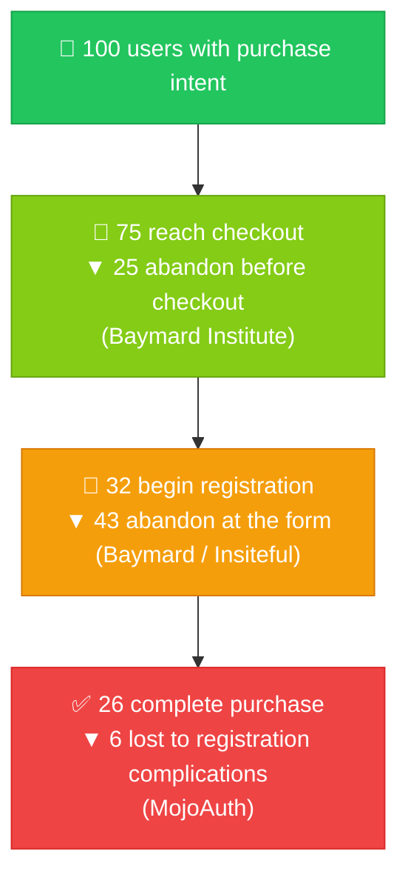
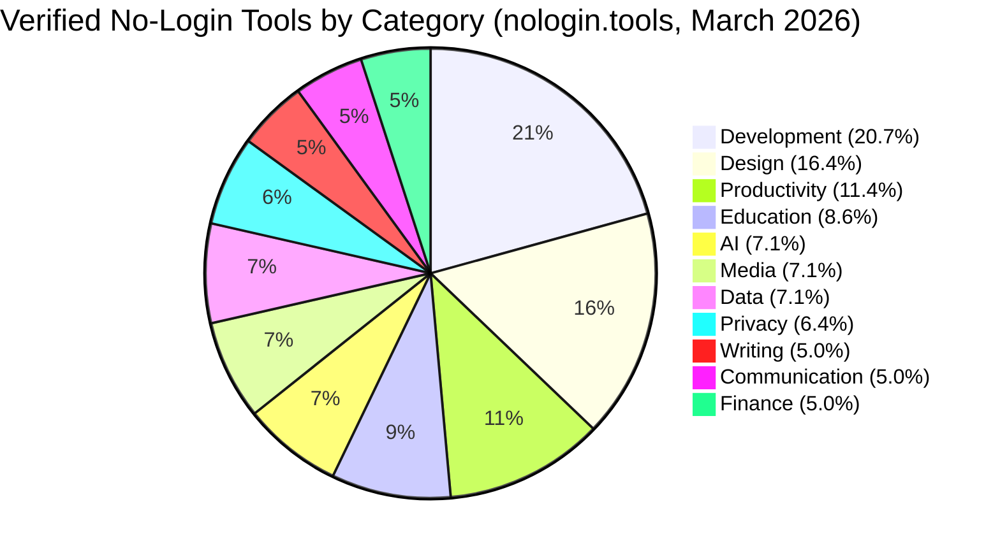
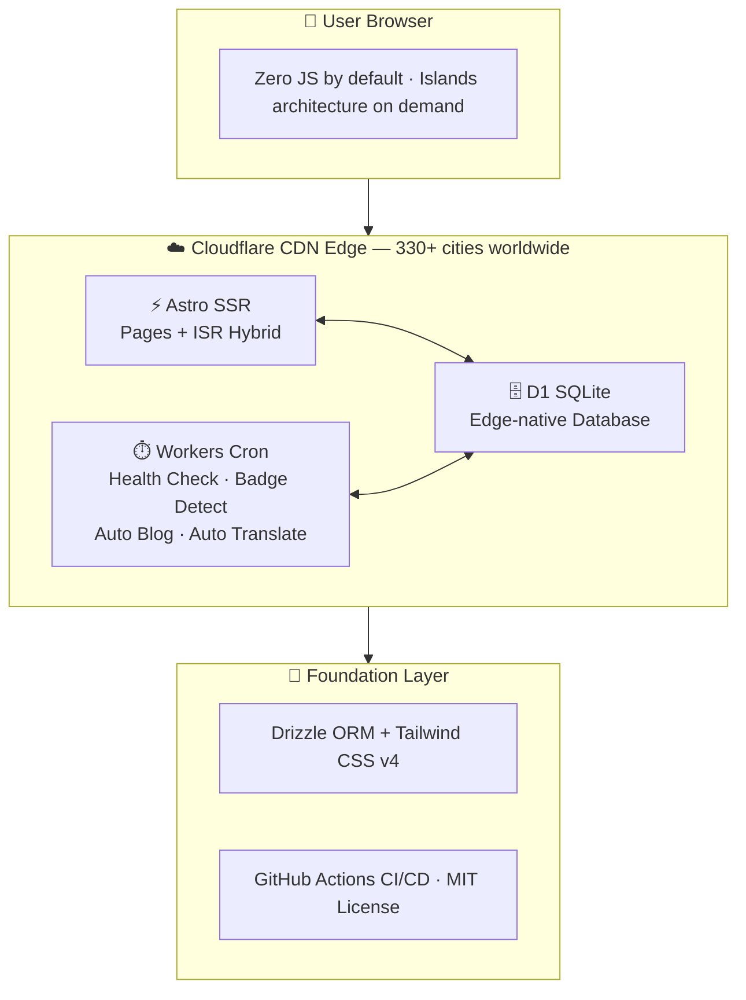

## Chapter 1: Foreword — NoLoginTools.org

### Who We Are

NoLoginTools.org is an independent organization dedicated to documenting, verifying, and advocating for the No-Login Web — a growing category of digital tools whose core functionality is fully accessible without user signup, login, or submission of personal data. Our flagship platform, nologin.tools, launched in March 2026 and has become the world's first verification-based directory dedicated exclusively to this category. As of publication, nologin.tools tracks over 140 verified tools across 11 categories, monitored continuously through automated health checks every six hours and accessible in eight languages.

### Defining the No-Login Web

The term "No-Login Web" refers to web-based tools and services whose primary functionality can be used immediately — without creating an account, providing an email address, accepting terms via a consent wall, or submitting any form of personally identifiable information. This is distinct from tools that require login for "full features" while offering a degraded free tier, or tools that use social sign-in as a friction-reduction mechanism. The No-Login Web is defined by a simple test: does the tool work right now, without knowing who you are?

This distinction matters. "Free to use" and "no registration required" are not the same claim. A tool that requires an email address to function — even a free tool — is collecting personal data, creating a user record, and assuming an obligation toward that user under an increasing body of global privacy law. The No-Login Web is defined by the absence of that step.

### Purpose of This Report

*The State of No-Login Web 2026* is the inaugural edition of what NoLoginTools.org intends to be an annual publication. It examines the structural forces — technological, regulatory, behavioral, and economic — driving the emergence of the No-Login Web as a meaningful and growing segment of the internet.

This report is grounded in two primary data sources:

1. **First-party data** from nologin.tools' continuous tracking of 140+ verified no-login tools, including category distribution, health monitoring, and badge adoption signals.
2. **Third-party industry research** from organizations including DLA Piper, Baymard Institute, Pew Research Center, NordPass, the Identity Theft Resource Center, Fortune Business Insights, and others, cited throughout with original source attribution.

This report is intended for tool developers and entrepreneurs, privacy and security practitioners, open source contributors, and media, analysts, and policymakers seeking to understand the trajectory of this emerging segment.

---

## Chapter 2: Executive Summary

The internet has a registration problem. As of 2024, the average person manages **255 passwords** — 168 personal, 87 work-related — according to NordPass' annual survey. Despite widespread awareness of the risks, **72% of Gen Z users** continue to reuse passwords across accounts (Business Wire, 2025). The behavioral pattern is rational: when the cost of creating and managing unique credentials for every service is prohibitive, convenience wins over security, and security erodes across the ecosystem.

The consequences are systemic. In January 2024, the "Mother of All Breaches" exposed **26 billion records** (Security Week). The U.S. recorded **3,158 data compromises** in 2024 (Identity Theft Resource Center). Regulators are responding: over **137 to 170 countries** have now enacted data privacy laws (UNCTAD, DLA Piper), and GDPR fines reached **€1.2 billion** in 2024 alone — cumulative total exceeding €4.47 billion.

Against this backdrop, a quiet structural shift is underway. A growing category of web tools — those that work without any registration requirement — is emerging as a credible alternative model. These tools demonstrate that useful, high-quality software can be delivered without collecting personal data at the point of entry.

**Key findings of this report:**

1. **The password crisis is structural, not behavioral.** With 255 passwords per person and 87% of users reporting password fatigue (Beyond Identity), the cognitive load of credential management has reached an unsustainable threshold. The solution is not better password hygiene — it is fewer passwords.

2. **Forced registration is a significant conversion barrier.** 25–26% of users abandon online checkouts specifically because they are required to create an account (Baymard Institute). Only 26 in 100 users with purchase intent convert when registration is mandated (MojoAuth). The registration wall costs the industry billions in abandoned transactions annually.

3. **Global privacy regulation has shifted from exception to norm.** With 137–170 countries having enacted data privacy laws, and GDPR enforcement generating €1.2 billion in fines in a single year, regulatory pressure on data-collecting businesses has become a structural feature of the market — not a transient risk to be managed.

4. **Data breach volumes make registration a liability.** In 2024, the U.S. alone saw 3,158 data compromises. Every registration form creates a data liability; tools that collect no data cannot breach it. The no-login model is a security architecture choice, not just a user experience choice.

5. **The no-login tool ecosystem is measurable and growing.** nologin.tools has verified 140+ tools across 11 categories as of March 2026. Development tools lead at 20.7%, followed by Design at 16.4%. AI-category tools are expanding rapidly despite the category's relative youth.

6. **Technology infrastructure has matured to support the no-login model.** Edge computing ($55–153 billion market in 2024), serverless architecture ($11.3–13.7 billion, CAGR ~29%), and modern frameworks like Astro have collectively lowered the barrier for building capable, stateless web applications at global scale.

7. **No-login tools can achieve significant commercial and community scale.** Photopea serves 1M+ daily users with ~$3M annual revenue — zero registration required. Excalidraw has 850K monthly active users and 94K+ GitHub stars. These are not edge cases; they are proof of a viable and increasingly attractive model.

---

## Chapter 3: The Crisis — Registration Fatigue & Privacy Erosion

### 3.1 The Scale of Password Fatigue

The internet was designed without a universal identity layer. In its absence, each service built its own — and users have been paying the cost ever since. According to NordPass' 2024 survey, the average person now manages **255 passwords** — 168 personal and 87 work-related. This number has grown steadily year over year as digital services proliferate across every domain of life.

**Figure 1: The Password Burden — Average Passwords per Person (NordPass 2024)**

| Category | Count | Share | Visual |
|---|---|---|---|
| Personal passwords | 168 | 65.9% | `██████████████████████████▌` |
| Work passwords | 87 | 34.1% | `█████████████▊` |
| **Total** | **255** | **100%** | |

*Source: NordPass 2024 Annual Password Survey*

The cognitive burden is substantial and widely acknowledged. **69% of adults feel overwhelmed** by the number of passwords they must remember (Pew Research Center). **87% of respondents** in the Beyond Identity survey report that password fatigue at least moderately affects their lives. The problem is not ignorance of best practices — it is the practical impossibility of applying them at scale. No person can maintain 255 unique, strong passwords without a dedicated password management system, and even that solution imposes real overhead that most users do not adopt.

Behavioral data confirms the predictable outcome: people cut corners. **72% of Gen Z users reuse passwords** despite knowing the risk (Business Wire, 2025). **59% of Gen Z recycles an existing password when updating accounts** — precisely the behavior that transforms a single breach into a cascading credential-stuffing event across multiple platforms.

This is the paradox at the heart of the registration model: the security it ostensibly provides is undermined by the behavioral responses it provokes. The more services require registration, the more users consolidate credentials; the more credentials are consolidated, the greater the blast radius of any single compromise. Requiring registration does not improve security in aggregate — it redistributes and concentrates risk.

### 3.2 The Business Toll of Forced Registration

Beyond the security implications, mandatory registration carries measurable business costs that are systematically underestimated by product teams operating within the registration paradigm.

The e-commerce sector offers the clearest data. The Baymard Institute, which conducts the most rigorous research on checkout abandonment, reports an average cart abandonment rate of **70–75%** in 2024. Within that figure, **25–26% of users explicitly cite being forced to create an account** as the reason they abandoned a purchase. Average form abandonment across web contexts is approximately **68%**, and **81% of people abandon a form after beginning to fill it out** (Reform.app, Formester citing Baymard). More starkly, **67% or more of visitors permanently leave a form** if they encounter any complications (Insiteful).

MojoAuth's analysis translates this into blunt conversion economics: of every **100 users with genuine purchase intent**, only **26 convert** after passing through a mandatory registration flow.

**Figure 2: The Registration Funnel — Where Users Are Lost**



*Sources: Baymard Institute (checkout abandonment), Insiteful (form abandonment), MojoAuth (conversion rate)*

The other 74 are lost — not to better competitors, but to the friction itself. In aggregate, this represents an enormous quantity of value destroyed by a design pattern so normalized that its costs are rarely attributed to it. Photopea, a browser-based Photoshop alternative requiring no account, serves over 1 million daily users — numbers that suggest the absence of registration friction is itself a growth mechanism.

### 3.3 The Vicious Cycle of Data Breaches

Registration does not merely inconvenience users — it creates persistent security liabilities that compound over time. The data breach statistics for 2024 illustrate the systemic nature of this risk.

In January 2024, the cybersecurity community identified what researchers termed the "Mother of All Breaches" — a compilation of previously stolen credentials and data that exposed **26 billion records** across thousands of services (Security Week). In April 2024, the National Public Data breach exposed approximately **2.9 billion records** (Have I Been Pwned). Across the full year, the U.S. Identity Theft Resource Center documented **3,158 total data compromises**.

Heimdal Security estimates that the largest historical password leak involved **16 billion passwords**, and that **94% of passwords are reused across multiple accounts**. The mathematics are unforgiving: a single breach of a low-security service effectively becomes a breach of every high-security service where the same credentials were reused.

The implication for the no-login model is direct: a tool that collects no personal data at registration cannot be breached in the ways described above. The no-login model is a security architecture choice — every registration form that disappears from the web represents one fewer attack surface, one fewer liability, one fewer breach waiting to happen.

---

## Chapter 4: The Regulatory Landscape

### 4.1 The Global Privacy Legislation Wave

The legal environment for data collection has transformed fundamentally over the past decade. As of 2024, over **137 to 170 countries** have enacted data privacy laws, covering approximately **79% of nations globally** (UNCTAD, DLA Piper).

**Figure 3: Global Data Privacy Legislation Coverage by Region (UNCTAD / IAPP, Jan 2025)**

| Region | Coverage | Visual |
|---|---|---|
| World Average | 79% | `████████████████████████████████` |
| Africa | 76% (~39/54 countries) | `██████████████████████████████▊` |
| Asia-Pacific | 65% | `██████████████████████████` |
| LDCs (Least Developed Countries) | 57% | `██████████████████████▊` |
| SIDS (Small Island Developing States) | 51% | `████████████████████▍` |

*Sources: UNCTAD Data Protection Tracker; IAPP Global Privacy Law and Tech Dashboard (144 jurisdictions as of January 2025)*

This is no longer a regional phenomenon driven by Europe's regulatory ambitions — it is a global structural shift in the legal framework governing personal data, touching virtually every jurisdiction in which digital services operate. Each registration form is a potential compliance obligation in dozens of legal frameworks, each with its own requirements for consent, retention limits, access rights, and breach notification timelines. For no-login tools, this compliance burden is largely moot. A tool that processes no personal data has no data subjects whose rights require protection, no consent to obtain, and no breach to report.

### 4.2 GDPR Enforcement Intensity

The General Data Protection Regulation remains the world's most actively enforced privacy framework. In 2024, GDPR fines totaled **€1.2 billion** across **2,245 enforcement cases** (DLA Piper, GDPR Enforcement Tracker). The cumulative total since GDPR came into force has exceeded **€4.47 billion**.

**Figure 4: GDPR Enforcement — Annual Fines and Cumulative Total (2018–2024)**

| Year | Annual Fines | Cumulative Total | Notable Enforcement Action |
|---|---|---|---|
| 2018 | ~€0.4M | ~€0.4M | GDPR takes effect (May 25) |
| 2019 | ~€417M | ~€418M | Google €50M (CNIL, France) |
| 2020 | ~€171M | ~€589M | H&M €35M; Google/Apple combined |
| 2021 | **~€1.28B** | ~€1.87B | Amazon €746M; WhatsApp €225M |
| 2022 | ~€1.06B | ~€2.93B | Meta €405M (Instagram) |
| 2023 | **~€2.1B** | ~€5.03B | Meta **€1.2B** — largest single fine in GDPR history |
| 2024 | ~€1.2B | **~€5.88B\*** | Uber €290M; 2,245 enforcement cases |

*\*Cumulative as of January 2025 per DLA Piper. Sources: DLA Piper GDPR Survey 2025, GDPR Enforcement Tracker, CMS Law Enforcement Tracker Report 2024.*

Equally significant is the operational burden of breach notification. In 2024, European data protection authorities received an average of **363 data breach notifications per day** — an increase of **8.3% year-over-year** (DLA Piper GDPR Survey 2025). The trajectory is unmistakable: GDPR enforcement is intensifying, not stabilizing.

### 4.3 CCPA/CPRA as the U.S. Driving Force

In the United States, California's Consumer Privacy Act (CCPA) and its successor, the California Privacy Rights Act (CPRA), represent the most significant domestic privacy enforcement framework. 2024 saw intensified enforcement activity, including the California Privacy Protection Agency (CPPA) issuing a record **$1.35 million fine** against a single company for violations involving opt-out rights and dark patterns (California AG / CPPA). As CPPA enforcement matures and other states enact comparable legislation, the U.S. regulatory environment is converging toward European levels of data protection obligation.

### 4.4 Browser Vendors' Privacy Response

The platform layer is responding to the same pressures as regulators. Apple's Safari has deployed Intelligent Tracking Prevention (ITP), blocking third-party cookies by default. Mozilla Firefox's Enhanced Tracking Protection (ETP) blocks cross-site trackers by default. Brave includes built-in ad and tracker blocking alongside Tor integration as standard features. User behavior reinforces these platform decisions: **67% of U.S. adults** actively disable cookies or website tracking (Pew Research).

The combined effect of regulatory pressure and browser-level privacy controls is to erode the infrastructure on which ambient user tracking and behavioral data collection depend. Regulation and browser evolution are not merely adding friction to data collection — they are actively turning no-login from a "nice-to-have" user experience feature into a "must-have" strategic posture for services that wish to operate sustainably across global markets.

---

## Chapter 5: The Rise of No-Login Tools — A Market Overview

### 5.1 Defining the No-Login Tool Taxonomy

NoLoginTools.org has developed a structured taxonomy for categorizing no-login tools across seven dimensions: **Category** (primary functional domain), **Data** (handling characteristics), **Privacy** (posture and tracking), **Type** (delivery model), **Hosting** (infrastructure model), **Offline** (network-free functionality), and **Pricing** (monetization model). This taxonomy enables systematic comparison across the no-login ecosystem and provides a consistent analytical framework for tracking evolution over time.

### 5.2 Profile of 140 Verified No-Login Tools

As of March 2026, nologin.tools has verified **140 tools** across **11 categories** as meeting the NoLogin Verified standard — the most comprehensive first-party dataset of the verified no-login tool ecosystem currently available.

| Category | Count | Share | Representative Tools |
|---|---|---|---|
| Development | 29 | 20.7% | Regex101, CyberChef, Hoppscotch, DevDocs |
| Design | 23 | 16.4% | Photopea, tldraw, Excalidraw, Coolors |
| Productivity | 16 | 11.4% | TinyWow, PDF24 Tools, QR Code Monkey |
| Education | 12 | 8.6% | WolframAlpha, Desmos, Python Tutor |
| AI | 10 | 7.1% | DuckDuckGo AI Chat, Perplexity |
| Media | 10 | 7.1% | ezGIF, Convertio, PhotoMosh |
| Data | 10 | 7.1% | JSON Crack, RAWGraphs, TableConvert |
| Privacy | 9 | 6.4% | Temp Mail, Have I Been Pwned, VirusTotal |
| Writing | 7 | 5.0% | Dillinger, Hemingway Editor, LanguageTool |
| Communication | 7 | 5.0% | Jitsi Meet, PairDrop, Wormhole |
| Finance | 7 | 5.0% | XE, Numbeo, FICalc |

**Figure 5: Verified No-Login Tools by Category — Distribution (nologin.tools, March 2026)**



*Source: nologin.tools first-party verification data, March 2026*

### 5.3 Category Analysis: Development Leads, AI Accelerates

Development tools constitute the largest category at **20.7%** of verified tools. This reflects the longstanding culture of open-source and freely-accessible tooling in software development communities. Tools like Regex101, CyberChef, Hoppscotch, and DevDocs have built large user bases precisely because developers resist unnecessary friction.

Design tools represent **16.4%** of the directory, driven by sophisticated browser-based applications that demonstrate the no-login model's viability for computation-intensive professional use cases. The AI category, at **7.1%** (10 tools), warrants particular attention despite its current size. Tools like DuckDuckGo AI Chat and Perplexity have demonstrated that AI-powered functionality can be delivered without mandatory registration — a significant challenge to the dominant AI platform model of mandatory accounts. As AI inference costs continue declining, the economic barrier to offering no-login AI access will decrease further.

### 5.4 Macro Support from the Privacy Technology Market

The global Privacy Enhancing Technologies (PETs) market was valued at **$2.7 to $4.4 billion** in 2024 (Fortune Business Insights, Precedence Research) and is projected to exceed **$12 billion** by 2030, growing at a compound annual rate of **17–24%**. The global data protection market is substantially larger, estimated at over **$179 billion** in 2025 with a CAGR of approximately **16.4%** (Research Nester). This investment creates favorable market conditions for no-login tools, which offer an inherently privacy-aligned value proposition without requiring dedicated compliance infrastructure.

### 5.5 Differentiation from Existing Directories

The no-login ecosystem is not well-served by existing tool discovery platforms. Product Hunt surfaces new tools but does not verify no-login status. AlternativeTo catalogs alternatives but does not filter by access model. GitHub awesome-lists provide community-curated collections but lack structured verification or continuous health monitoring.

nologin.tools fills a specific and previously unoccupied gap: systematic human verification of the no-login claim, continuous automated monitoring, and structured categorization across consistent dimensions. The no-login claim is not stable — services that launch without registration sometimes add it later — making ongoing verification essential to directory trustworthiness.

---

## Chapter 6: The NoLogin Verified Standard

### 6.1 Definition and Design Philosophy

The NoLogin Verified standard is a digital trust certification established by NoLoginTools.org. It identifies tools whose **core functionality** has been manually verified to work without registration, login, or submission of personally identifiable information. The emphasis on "core functionality" is deliberate: many tools offer limited free tiers alongside paid subscriptions — the standard is concerned with whether the primary use case is accessible without registration, not whether advanced features exist behind a paywall.

### 6.2 Verification Process in Detail

The verification process follows a structured workflow:

```
Submit tool → Manual review (~48h) → Approval → NoLogin Verified certification
                                                  │
                                                  ├── Listed in public directory
                                                  ├── Automated health monitoring begins (every 6h)
                                                  ├── Archived to web.archive.org
                                                  └── Badge embed code issued
```

Approved tools enter continuous health monitoring. Tools that subsequently add registration requirements can have their verified status revised. The system is not a one-time snapshot — it is a continuous relationship with each verified tool.

### 6.3 Recommendation Scoring and Ecosystem Incentives

Verified tools receive a recommendation score based on observable trust signals:

| Signal | Points |
|---|---|
| SVG badge displayed on tool website | +10 |
| Meta/link badge embedded | +5 |
| Approved within 30 days | +5 |
| Approved within 90 days | +3 |
| Currently online | +3 |

The scoring system creates ecosystem incentives aligned with the no-login mission. Tools that embed the NoLogin Verified badge signal their commitment to the standard while gaining higher placement in the directory. Health status directly influences score, creating incentive for maintainers to keep tools operational and accessible.

### 6.4 The Trust-Signal Value of the Badge

The NoLogin Verified badge serves a function analogous to security certifications in enterprise software: it externalizes trust verification so that individual users do not need to evaluate each tool's access model independently. As the no-login ecosystem grows and more tools claim no-login status — accurately or inaccurately — the ability to distinguish between genuine no-login tools and tools that use the label loosely becomes increasingly important.

The industry precedent is instructive. Let's Encrypt, operated by the Internet Security Research Group, created a trusted, automated certificate authority that transformed HTTPS from an optional enhancement to a baseline expectation. The NoLogin Verified standard aspires to an analogous role: a credible, independent verification layer that makes the no-login claim trustworthy at ecosystem scale.

---

## Chapter 7: Technology Enabling the No-Login Web

### 7.1 The Rise of Edge Computing

The architectural foundation for no-login tools — stateless, session-free, data-minimizing — maps cleanly onto edge computing infrastructure. The edge computing market was valued at **$55 to $153 billion** in 2024 (MarketsandMarkets, Market.us), growing at approximately **18.3% CAGR**. AI applications at the edge are projected to reach **$83.86 billion** by 2032 at a CAGR of ~22.5% (SNS Insider). Cloudflare's global network, spanning **330+ cities in 125+ countries**, exemplifies the edge infrastructure on which the No-Login Web increasingly runs. A no-login tool running on edge infrastructure today has comparable global distribution to an enterprise service at a fraction of the operational cost.

### 7.2 Serverless Architecture Lowering Barriers

The serverless computing market, valued at **$11.3 to $13.7 billion** in 2024 and growing at approximately **29% CAGR** (SPER Market Research), has fundamentally altered the economics of deploying web applications. Pay-per-use billing means a tool serving moderate traffic incurs near-zero infrastructure cost at low-volume periods — removing the pressure to monetize through user data collection that fixed server costs create. Critically, serverless architecture incentivizes stateless design — applications that do not maintain server-side session state between requests. This architectural pattern is a natural fit for no-login tools, which by definition do not need to maintain user sessions.

### 7.3 Modern Frameworks Driving Content-First Web Experiences

Astro represents the most significant example of the shift toward content-first, performance-first frameworks. In 2024, Astro's npm weekly downloads nearly doubled, from approximately 186,000 to over **364,000**. GitHub stars grew from 37,000 to 48,000, now exceeding 57,500. The State of JavaScript 2024 survey ranked Astro **#1 in Interest, Retention, and Positivity** among meta-frameworks. Enterprise adoption validates the trend: IKEA and Porsche have adopted Astro for production deployments, with official partnerships with Netlify and Google IDX. Astro's "islands" architecture allows precisely defined islands of interactivity within otherwise static pages — enabling sophisticated client-side functionality without the overhead of full SPA frameworks.

### 7.4 nologin.tools Tech Stack as a Case Study

The nologin.tools platform is itself built on the infrastructure stack it documents, providing a working example of the no-login technology model applied to a production directory service.

| Layer | Technology | Rationale |
|---|---|---|
| Framework | Astro (SSR/ISR hybrid) | Near-zero JS output, SEO-friendly, top performance |
| Hosting | Cloudflare Pages + Workers | Edge deployment across 330+ cities, <50ms global |
| Database | Cloudflare D1 (SQLite) | Edge-native, no standalone database server required |
| ORM | Drizzle ORM | Type-safe, lightweight, minimal overhead |
| Styling | Tailwind CSS v4 | Atomic CSS, on-demand generation, minimal bundle |
| Cron | Cloudflare Workers (scheduled) | Zero-ops automated execution |

**Figure 6: nologin.tools Architecture — Layered System Overview**



*The static-first rendering strategy — pre-generating HTML at build time, refreshing every six hours via scheduled rebuilds, serving new tools through ISR fallback — delivers consistent global performance while maintaining data freshness appropriate for the use case.*

---

## Chapter 8: Case Studies — No-Login Success Stories

The following case studies examine representative tools from the nologin.tools directory that have achieved significant scale, demonstrating that the no-login model is not a constraint on growth but a growth strategy in its own right.

### 8.1 Photopea: Commercial Success Without Registration

Photopea is a browser-based image editor that supports Photoshop's native PSD format, along with AI, XCF, Sketch, and other professional file formats. It runs entirely client-side, with no account required. When Photopea launched in 2013, it had approximately **5,000 daily users**. By 2024, it serves over **1 million daily users** and generates approximately **$3 million in annual revenue** primarily through display advertising. This growth occurred without venture funding, without a free-to-paid conversion funnel based on registration, and without the data collection that typically underlies advertising-technology businesses.

Every potential Photopea user who encounters the tool for the first time and finds that it works immediately — without creating an account, without providing an email address — is a converted user. The funnel has no registration step, so the drop-off at that step is zero. This structural advantage compounds over time.

### 8.2 Excalidraw: Open-Source Collaboration at Scale

Excalidraw is a virtual whiteboard tool for sketching hand-drawn-style diagrams and wireframes. It is open-source (MIT license), free to use, and requires no account for its core collaborative functionality. Users can navigate to the URL, begin drawing immediately, and share a real-time collaboration link — all without any registration step. As of 2024, Excalidraw has approximately **850,000 monthly active users** and **94,000+ GitHub stars**.

Excalidraw's collaboration model is architecturally instructive: real-time collaboration without user accounts is implemented through ephemeral shared rooms linked by URL. There is no user identity in the system — only a shared session that exists for the duration of collaboration. This is privacy by design at the collaboration layer: the system has nothing to breach because there is no user data to collect.

### 8.3 Jitsi Meet: Video Conferencing as Public Infrastructure

Jitsi Meet is an open-source video conferencing platform maintained by 8x8. It allows anyone to create a meeting room by navigating to a URL and share that URL with participants — no account required for either host or participants. Jitsi gained significant attention during the COVID-19 pandemic as a privacy-respecting alternative to commercial platforms that required accounts and collected behavioral data. For organizations in healthcare, legal, education, and government — where communication tools must comply with strict data protection requirements — Jitsi's no-registration model simplifies compliance significantly. There are no user records to protect, no consent flows to implement, no retention schedules to enforce.

### 8.4 Have I Been Pwned: Privacy Checking as Public Service

Have I Been Pwned (HIBP) is a web service that allows users to check whether their email address appears in known data breach databases. As of 2026, HIBP's database contains over **14 billion breached records** across hundreds of documented incidents. Users submit an email address and receive an immediate breach status report — entirely without creating an account. The position HIBP occupies is pointed: the most comprehensive publicly accessible database of breached credentials is itself a no-login service. Mozilla Firefox integrates HIBP's breach data into its password manager. Security teams at organizations worldwide use it for employee credential monitoring. All of this at-scale adoption occurs without user accounts.

### 8.5 Cross-Case Analysis: No-Login as Growth and Trust Infrastructure

**Figure 7: No-Login Success Stories — Scale and Sustainability Comparison**

| Tool | Category | Scale | GitHub Stars | Revenue Model | No-Login Since |
|---|---|---|---|---|---|
| **Photopea** | Design | 1M+ DAU | N/A (proprietary) | Ads (~$3M/yr) | Launch (2013) |
| **Excalidraw** | Design | 850K MAU | 94K+ | Open Source | Launch (2020) |
| **Jitsi Meet** | Communication | Millions (pandemic peak) | 23K+ | 8x8 Sponsored | Launch (2003) |
| **tldraw** | Design | Growing | 42K+ | VC-funded | Launch (2021) |
| **Have I Been Pwned** | Privacy | Millions of queries | N/A | Public service | Launch (2013) |
| **CyberChef** | Development | High (institutional) | 30K+ | Government-built (GCHQ) | Launch (2016) |

*Sources: Official project statistics, GitHub, publicly reported figures (point-in-time measurements, 2024)*

Across these six case studies — spanning professional design software, collaborative whiteboards, video conferencing, security tooling, diagramming, and data transformation — consistent patterns emerge:

**Frictionless access enables referral-driven growth.** Tools that work immediately benefit from word-of-mouth referral where the recipient can verify the recommendation without commitment. "Try this, just go to the URL" is a more powerful referral mechanism than "sign up for this."

**No user data means no breach liability of that category.** None of these tools has experienced the specific category of breach involving user credential exposure — because none collected user credentials. The attack surface simply does not exist.

**Open-source and no-login are complementary trust signals.** Open-source eliminates the information asymmetry around what data is collected — the code is inspectable. No-login eliminates the data collection itself. Together they constitute a strong trust posture.

**The model is commercially viable at scale.** Photopea's $3 million annual revenue from 1 million daily users demonstrates that advertising-supported no-login tools can sustain meaningful commercial operations without user accounts or a data business.

---

## Chapter 9: 2026 Outlook & The Road Ahead

### 9.1 Industry Predictions

**The no-login tool count will accelerate.** The structural forces driving the no-login model — registration fatigue, regulatory pressure, data breach risk, mature edge infrastructure, and declining compute costs — show no signs of reversing. The 140 tools verified by nologin.tools as of March 2026 represent the visible, verified surface of a much larger ecosystem.

**More SaaS products will offer substantive "no-login trial" modes.** Commercial software products are recognizing that the hard registration wall is a conversion barrier with quantifiable cost. The strategic response — offering meaningful core functionality without account creation, with optional registration for persistence, collaboration, and advanced features — is becoming an increasingly common product architecture.

**Privacy regulations will continue driving industry transformation.** The regulatory trajectory across all major markets is toward more comprehensive data protection requirements, stricter enforcement, and higher penalties. Emerging regulatory frameworks in Asia — Japan's APPI, South Korea's PIPA, India's DPDP Act — are strengthening and converging toward higher standards. Services that minimize data collection are inherently better positioned in this environment.

**The AI category will be contested terrain for the no-login model.** AI services typically depend on large-scale data for model improvement, and capable model inference is expensive at scale. Yet the emergence of verifiably no-login AI tools in the nologin.tools directory demonstrates that useful AI functionality can be delivered without mandatory registration. As AI inference costs decline and privacy-preserving AI architectures mature, this tension will resolve differently across application categories.

### 9.2 NoLoginTools.org Action Roadmap

NoLoginTools.org's forward roadmap reflects both the organization's operational development and its view of the infrastructure investments the no-login ecosystem needs to reach maturity as a recognized and trustworthy category.

**Q2 2026 (Short-Term)**: Expand the directory to **300+ verified tools**. Launch a **public search API** enabling third-party applications to query the directory programmatically. Add **RSS feeds** for new verified tools and category-level subscription.

**2026 H2 (Mid-Term)**: Open the **verification API**, allowing partner organizations to query tool verification status programmatically. Launch a **browser extension** that surfaces NoLogin Verified status on tool websites in context. Add **Webhooks** for developer integrations and **third-party integrations** with developer toolchains.

**2027+ (Long-Term)**: Pursue establishment of a **formal industry certification standard** for no-login tools, developed in collaboration with privacy advocacy organizations, browser vendors, regulatory bodies, and tool developers. Develop a **federated directory model** enabling multiple organizations to contribute to a shared, decentralized ecosystem. Publish an annual **State of No-Login Web** report as the longitudinal reference for the category.

**Figure 8: NoLoginTools.org — Strategic Roadmap 2026–2027+**

```mermaid
gantt
    title NoLoginTools.org Strategic Roadmap
    dateFormat YYYY-MM-DD
    axisFormat %b %Y

    section 2026 Q1 — Foundation
    Launch: 140 tools, 8 languages         :done,   q1a, 2026-03-01, 2026-03-31
    Automated pipelines live               :done,   q1b, 2026-03-01, 2026-03-31

    section 2026 Q2 — Expansion
    300+ verified tools                    :active, q2a, 2026-04-01, 2026-06-30
    Public search API                      :active, q2b, 2026-04-15, 2026-06-30
    RSS feeds                              :active, q2c, 2026-05-01, 2026-06-30

    section 2026 H2 — Integration
    Open verification API                  :        q3a, 2026-07-01, 2026-12-31
    Browser extension                      :        q3b, 2026-08-01, 2026-12-31
    Webhooks & third-party integrations    :        q3c, 2026-09-01, 2026-12-31

    section 2027+ — Industry Standard
    Formal certification standard          :        q4a, 2027-01-01, 2027-06-30
    Federated directory model              :        q4b, 2027-03-01, 2027-09-30
    Annual State of No-Login Web report    :        q4c, 2027-03-01, 2027-03-31
```

The roadmap is explicitly designed to serve the ecosystem, not just the organization. A public API, a browser extension, and a federated directory model are infrastructure investments that raise the discoverability and trustworthiness of no-login tools across the web — independent of whether users engage with nologin.tools directly.

---

## Chapter 10: Methodology & Data Sources

### Data Collection Methods

**nologin.tools Platform Data**: First-party data in this report derives from nologin.tools' operational systems. Tool verification is conducted manually through human review of each submitted tool. Health monitoring is automated with checks every six hours using GET requests with a documented User-Agent string (`NoLoginTools-HealthChecker/1.0`) to ensure transparency with monitored services. Badge detection uses automated scanning with a separate User-Agent (`NoLoginTools-BadgeChecker/1.0`). All platform data reflects the state of the directory as of March 2026.

**Public Industry Reports**: The following primary reports and surveys are cited in this document:
- DLA Piper GDPR Survey 2025 (GDPR enforcement data, breach notification volumes)
- Baymard Institute Research Reports (cart abandonment, registration friction data)
- NordPass 2024 Annual Password Report (password count data by category)
- Pew Research Center Privacy Surveys (consumer attitudes toward privacy and tracking)
- Beyond Identity Consumer Survey (password fatigue prevalence data)
- Business Wire, 2025 (Gen Z password behavior research)
- Identity Theft Resource Center 2024 Annual Data Breach Report
- Security Week (breach incident reporting)
- MojoAuth Research (registration conversion impact data)
- UNCTAD Data Protection Tracker; IAPP Global Privacy Law and Tech Dashboard

**Market Research Estimates**: Fortune Business Insights and Precedence Research (PETs market); MarketsandMarkets and Market.us (edge computing); SPER Market Research (serverless computing); SNS Insider (AI in edge computing); Research Nester (data protection market).

**Caveats**: Market size estimates reflect the variability typical of emerging technology market sizing. Where ranges are cited, both endpoints are reported. Tool-level statistics represent publicly available figures and point-in-time measurements.

### Open Data Commitment

NoLoginTools.org operates under an MIT open-source license. Tool directory data is exported daily in structured format to a public GitHub awesome-list, enabling third-party use, independent analysis, and community verification. Community contributors can flag inaccuracies through a wiki-mode submission mechanism.

---

## Chapter 11: Join the Movement

The No-Login Web is built by the developers who create tools that respect users' time and privacy, the communities that maintain and advocate for these tools, and the users who demonstrate through their daily choices that friction-free, privacy-respecting access is valued.

**Submit a tool**: nologin.tools/submit — Verification is free and typically completed within 48 hours.

**Embed the badge**: If your tool is NoLogin Verified, embed the NoLogin Verified badge on your site. It tells your users that an independent organization has verified your no-login claim and monitors it continuously.

**Contribute to the platform**: The nologin.tools codebase is open source under the MIT license and actively developed. Contributions of code, documentation, translations, or tool suggestions are welcome.

**Follow the conversation**: @nologin\_tools covers directory updates, industry analysis, and the evolving privacy landscape that makes this work matter.

---

*NoLoginTools.org — The web should work without walls.*

---

*© 2026 NoLoginTools.org. Published under Creative Commons Attribution 4.0 International (CC BY 4.0). Share and adapt with attribution. Directory data available under MIT license at github.com/nologin-tools/nologin.tools.*

---
